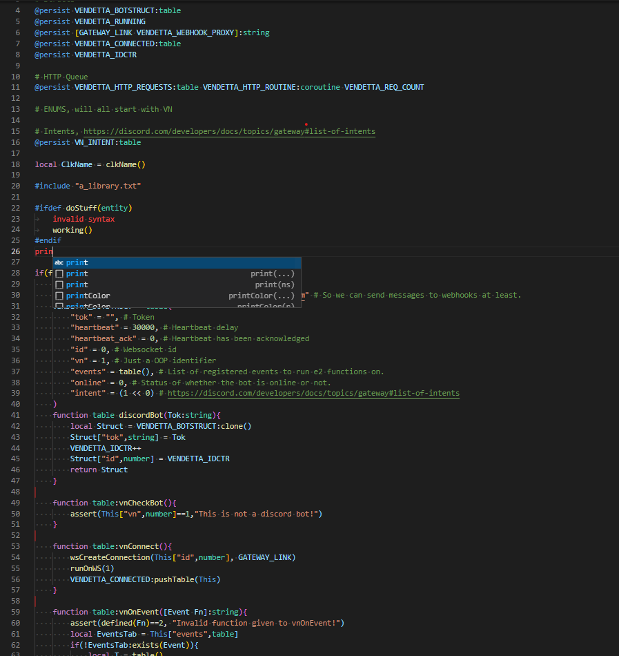

# ``Expression-LS``  [

Adds [Expression2](https://github.com/wiremod/wire) support to [Visual Studio Code](https://code.visualstudio.com/).

## Features
- [x] 100% Covered Syntax Highlighting
- [x] Snippets
- [x] Hints for information like return type, OpS cost, parameter names..
- [x] Code folding compatibility
- [x] Whitelisted highlights that help you tell if your code is invalid.
- [ ] Intellisense
- [ ] Builtin Parser

## Why?
1. To hopefully get the language on https://github.com/github/linguist
2. For proper syntax highlighting instead of golo.
3. As a decent way to create this code outside of the in-game editor.
4. For https://github.com/Vurv78/ExpressionScript 

## Usage
Download it [here](https://marketplace.visualstudio.com/items?itemName=Vurv78.e2-ls)

## Contributing
Issues and PRs are always open.

## Showcase
*Using VSCode Dark+ and Bracket Colorizer 2*

